# Інструкція адміністратора / менеджера — Art Beton Market

## Зміст
1. [Вхід в адмін-панель](#1-вхід-в-адмін-панель)
2. [Головна сторінка](#2-головна-сторінка)
3. [Продукти](#3-продукти)
4. [Категорії](#4-категорії)
5. [Замовлення](#5-замовлення)
6. [Користувачі](#6-користувачі)
7. [Нова Пошта — ТТН](#7-нова-пошта--ттн)

---

## 1. Вхід в адмін-панель

**URL:** [https://api.artbeton.market/admin](https://api.artbeton.market/admin)

**Посилання на проєкт:**

| Ресурс | URL |
|--------|-----|
| **Адмін-панель** | [https://api.artbeton.market/admin](https://api.artbeton.market/admin) |
| **API (backend)** | [https://api.artbeton.market](https://api.artbeton.market) |
| **Сайт (frontend)** | [https://artbeton.market](https://artbeton.market) |
| **Telegram-бот (прод)** | [@prod_beton_decor_bot](https://t.me/tbuddet_bot) |
| **Telegram-бот (тест)** | [@BetonDecorBot](https://t.me/dev_tbuddet_bot) |

Для доступу потрібно:
1. Запустити Telegram-бот ([@prod_beton_decor_bot](https://t.me/tbuddet_bot)) та натиснути **/start**
2. Перейти на [https://api.artbeton.market/admin](https://api.artbeton.market/admin)
3. Увійти через **Telegram-віджет** (кнопка "Увійти через Telegram")

> Доступ мають лише користувачі з роллю **ROLE_ADMIN**. Для надання прав розробник виконує команду на сервері:
> ```bash
> php bin/console app:assign-role --phone=380XXXXXXXXX --role=ROLE_ADMIN
> ```
> Якщо ви бачите помилку 403 — зверніться до розробника для надання прав.

---

## 2. Головна сторінка

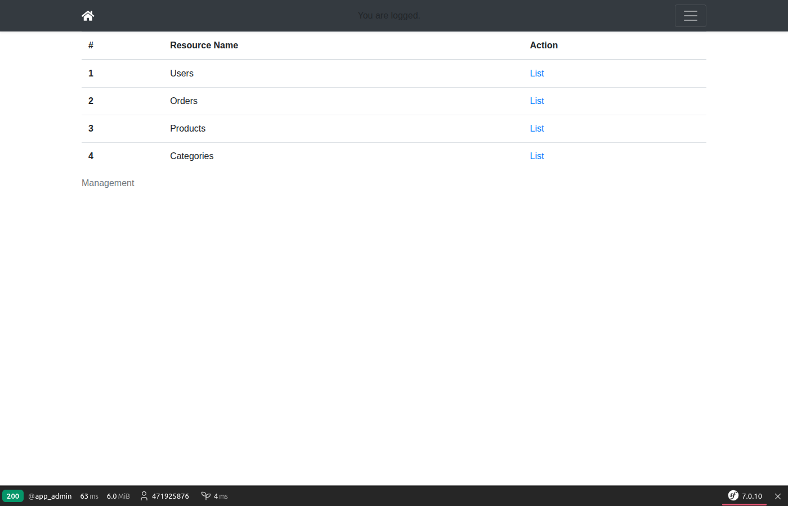

На головній сторінці доступні розділи:
| # | Розділ | Опис |
|---|--------|------|
| 1 | **Users** | Список користувачів Telegram-бота |
| 2 | **Orders** | Замовлення з сайту та бота |
| 3 | **Products** | Каталог товарів |
| 4 | **Categories** | Категорії товарів |

---

## 3. Продукти

### 3.1. Список продуктів

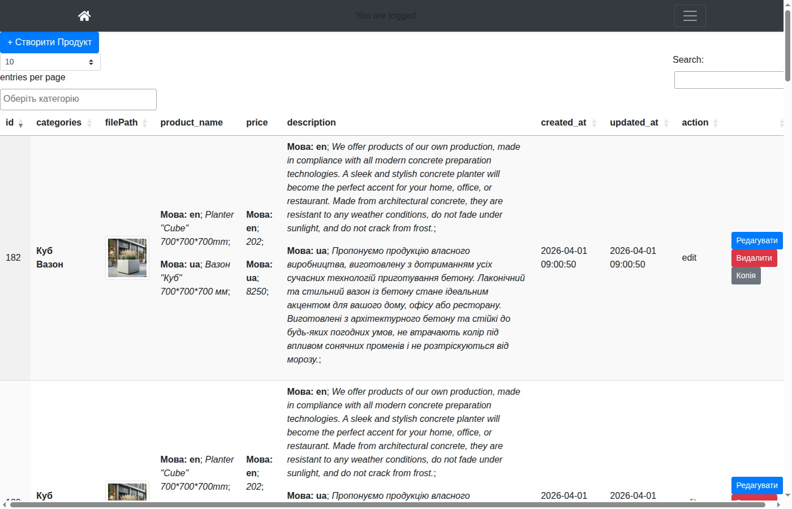

- Таблиця з усіма продуктами (серверна пагінація)
- **Пошук** — введіть текст у поле "Пошук" (шукає по назві, ціні, опису)
- **Створити** — натисніть кнопку "+ Створити продукт" (відкривається в новій вкладці)
- **Редагувати** — натисніть "Редагувати" біля продукту (відкривається в новій вкладці)
- **Видалити** — натисніть "Видалити" (з підтвердженням)

### 3.2. Форма створення / редагування продукту

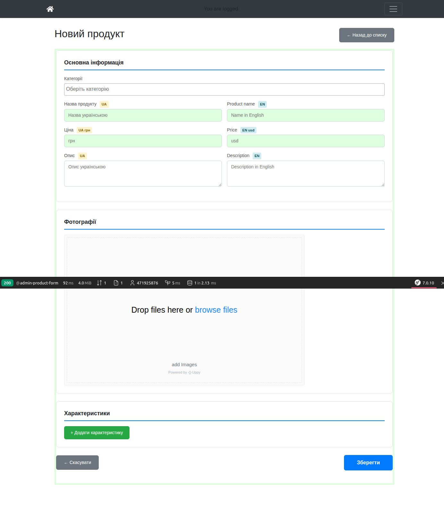

**Поля форми:**

| Поле | Опис | Обов'язкове |
|------|------|:-----------:|
| Категорії | Вибір із випадаючого списку (можна декілька) | Так |
| Назва продукту (UA) | Назва українською | Так |
| Product name (EN) | Назва англійською | Ні |
| Ціна (UA грн) | Ціна в гривнях (додатне число) | Так |
| Price (EN usd) | Ціна в доларах | Ні |
| Опис (UA) | Опис українською | Ні |
| Description (EN) | Опис англійською | Ні |
| Фотографії | Завантаження через Drag & Drop або "browse files" | Ні |
| Характеристики | Властивості товару (колір, розмір, вага тощо) | Так (мін. 1) |

### 3.3. Валідація

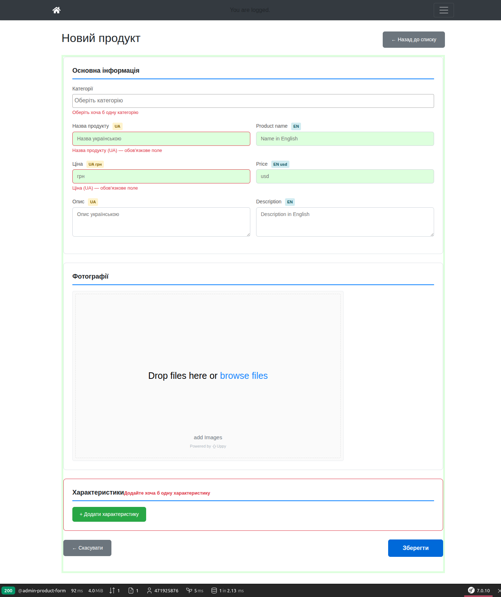

При збереженні з порожніми обов'язковими полями з'являються підказки:
- **Червоний текст** під кожним порожнім полем
- **Червона рамка** навколо секції "Характеристики", якщо немає жодної властивості
- Ціна перевіряється на додатне число (від'ємна або текстова — відхиляється)

### 3.4. Характеристики

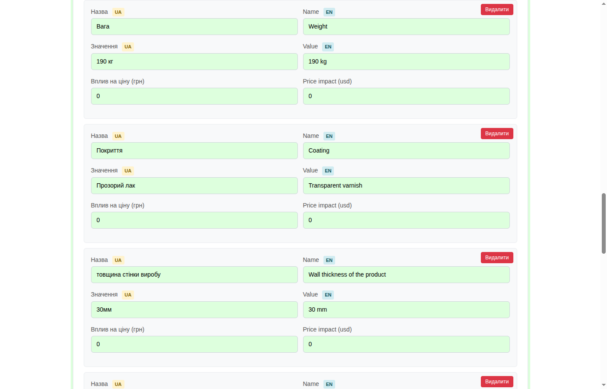

- Натисніть **"+ Додати характеристику"** для нового рядка
- Кожна характеристика має: Назва (UA/EN), Значення (UA/EN), Вплив на ціну (грн/usd)
- Натисніть **"Видалити"** щоб прибрати характеристику
- Порожні характеристики автоматично видаляються при збереженні

### 3.5. Редагування продукту

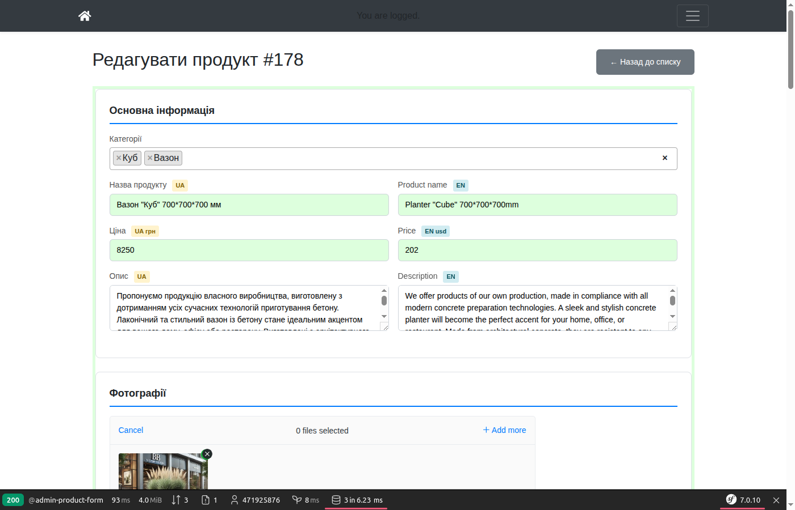

- Відкрийте продукт для редагування — всі поля заповнені існуючими даними
- Змініть потрібні поля та натисніть **"Зберегти"**
- Після збереження сторінка залишається на формі редагування

---

## 4. Категорії

### 4.1. Список категорій

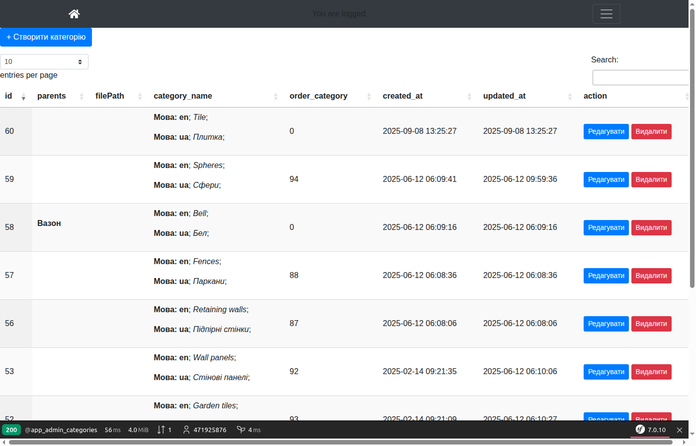

- Таблиця з усіма категоріями
- **Створити** — кнопка "+ Створити категорію" (нова вкладка)
- **Редагувати** — кнопка "Редагувати" (нова вкладка)
- **Видалити** — кнопка "Видалити" (з підтвердженням)

### 4.2. Форма категорії

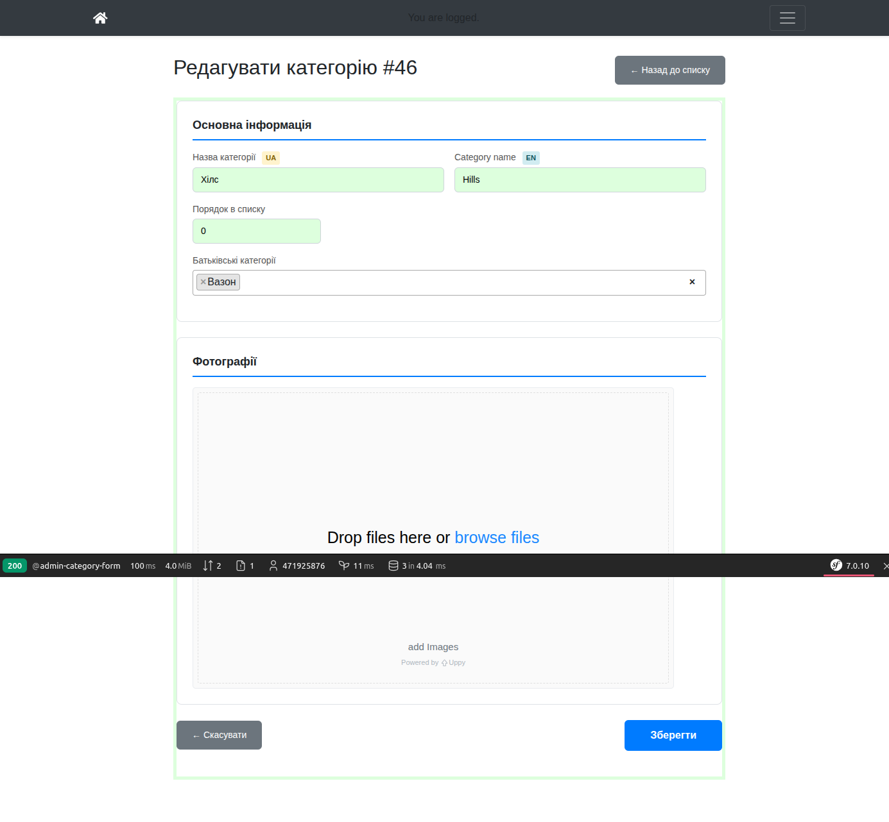

**Поля:**

| Поле | Опис | Обов'язкове |
|------|------|:-----------:|
| Назва категорії (UA) | Назва українською | Так |
| Category name (EN) | Назва англійською | Ні |
| Порядок в списку | Число для сортування (менше = вище) | Ні |
| Батьківські категорії | Вибір батьківської категорії (можна декілька) | Ні |
| Фотографії | Зображення категорії | Ні |

---

## 5. Замовлення

### 5.1. Список замовлень

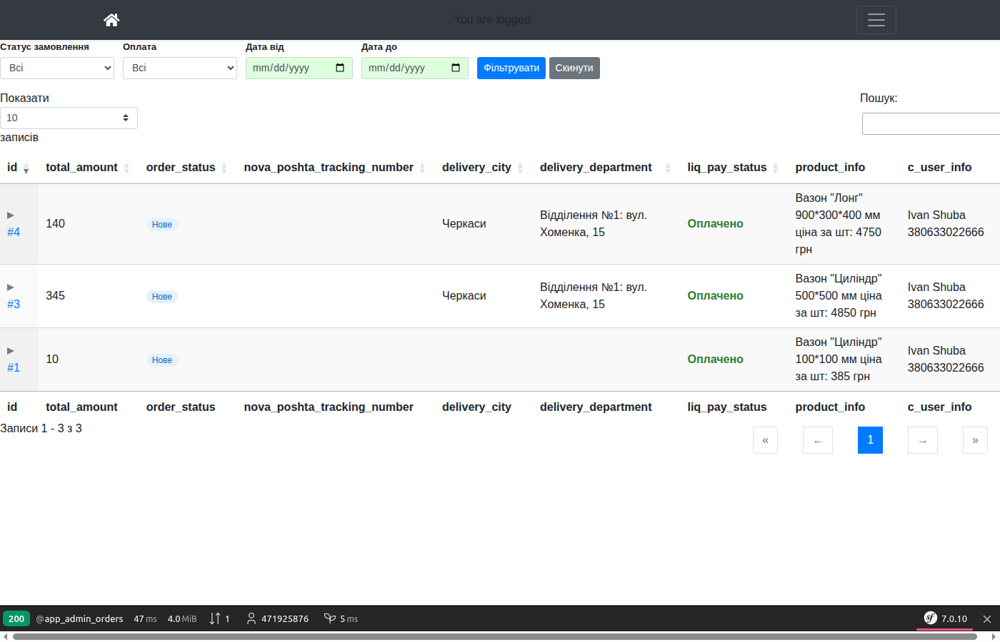

**Фільтри** (верхня панель):

| Фільтр | Опис |
|--------|------|
| **Статус замовлення** | Всі / Нове / В обробці / Відправлено / Доставлено / Скасовано |
| **Оплата** | Всі / Оплачено / Не оплачено / Очікує |
| **Дата від** | Показати замовлення починаючи з цієї дати |
| **Дата до** | Показати замовлення до цієї дати |

- Натисніть **"Фільтрувати"** для застосування
- Натисніть **"Скинути"** для скидання всіх фільтрів
- Поле **"Пошук"** шукає по всіх полях (клієнт, місто, товар, ТТН тощо)

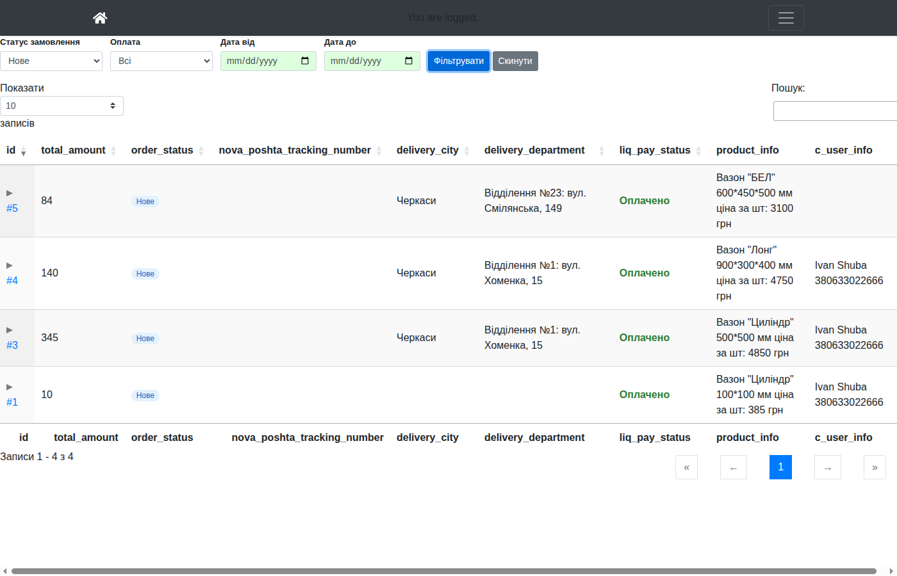

**Колонки таблиці:**

| Колонка | Опис |
|---------|------|
| **id** | Номер замовлення (клікабельний — відкриває деталі) |
| **total_amount** | Сума замовлення (грн) |
| **order_status** | Статус з кольоровим індикатором |
| **nova_poshta_tracking_number** | ТТН Нової Пошти (клікабельний — відкриває трекінг) |
| **delivery_city** | Місто доставки |
| **delivery_department** | Відділення Нової Пошти |
| **liq_pay_status** | Статус оплати LiqPay |
| **product_info** | Інформація про товар |
| **c_user_info** | Клієнт (ім'я, телефон) |
| **t_user_info** | Telegram-користувач |
| **created_at** | Дата створення |

### 5.2. Деталі замовлення

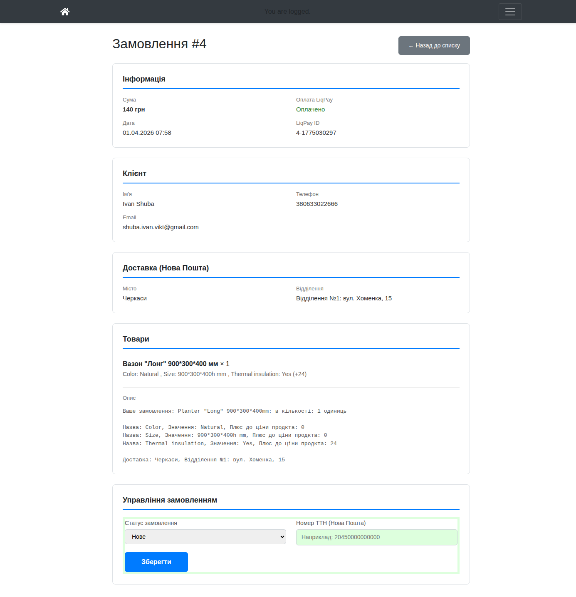

На сторінці деталей замовлення відображається:
- **Сума** замовлення
- **Статус оплати** LiqPay та ідентифікатор платежу
- **Дані клієнта** (ім'я, телефон, email)
- **Доставка** — місто та відділення Нової Пошти
- **Товари** — список товарів із кількістю та властивостями

### 5.3. Зміна статусу замовлення та ТТН

На сторінці деталей можна:

1. **Змінити статус** — виберіть новий статус з випадаючого списку:
   - `new` → `processing` → `shipped` → `delivered`
   - `cancelled` — для скасованих
2. **Вказати ТТН Нової Пошти** — введіть номер накладної у поле "ТТН"
3. Натисніть **"Оновити"** для збереження

**Рекомендований процес обробки замовлення:**

```
Нове замовлення (new)
    ↓ Перевірити оплату (liq_pay_status = success)
В обробці (processing)
    ↓ Підготувати та відправити
Відправлено (shipped) + вказати ТТН
    ↓ Клієнт отримав
Доставлено (delivered)
```

> Коли ви вказуєте ТТН — клієнт зможе відстежити посилку за посиланням у таблиці замовлень.

---

## 6. Користувачі

### 6.1. Список користувачів

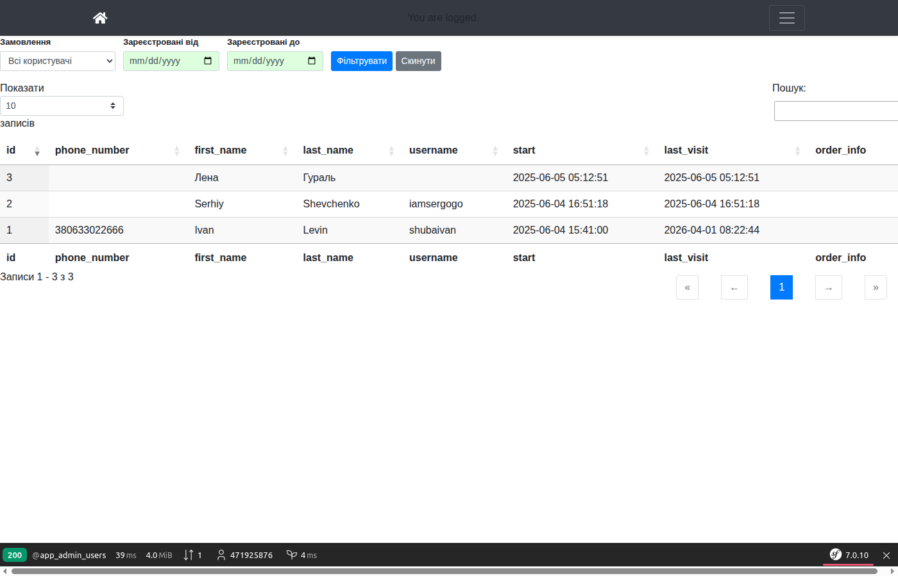

**Фільтри:**

| Фільтр | Опис |
|--------|------|
| **Замовлення** | Всі / З замовленнями / Без замовлень |
| **Зареєстровані від** | Фільтр по даті реєстрації |
| **Зареєстровані до** | Фільтр по даті реєстрації |

**Колонки:**

| Колонка | Опис |
|---------|------|
| **id** | ID користувача |
| **phone_number** | Номер телефону |
| **first_name** | Ім'я |
| **last_name** | Прізвище |
| **username** | Telegram username |
| **start** | Дата реєстрації |
| **last_visit** | Дата останнього візиту |
| **order_info** | Замовлення користувача |

---

## 7. Нова Пошта — ТТН

### Як додати ТТН до замовлення

1. Відкрийте **Замовлення** → знайдіть потрібне
2. Натисніть на **номер замовлення** (напр. `#4`) — відкриється деталі
3. Введіть **номер ТТН** у поле "ТТН Нової Пошти"
4. Змініть статус на **"shipped"** (Відправлено)
5. Натисніть **"Оновити"**

Після цього:
- ТТН відображається у таблиці замовлень як **клікабельне посилання** на трекінг Нової Пошти
- Клієнт може відстежити посилку

### API Нової Пошти

Адмін-панель використовує API Нової Пошти для:
- Пошуку міст доставки
- Пошуку відділень у місті

Ці дані заповнюються автоматично при оформленні замовлення через сайт або Telegram-бот.

---

## 8. Telegram-бот

### 8.1. Як працює бот

Бот доступний у Telegram: **@prod_beton_decor_bot** (прод) / **@BetonDecorBot** (тест)

Щоб почати, натисніть **/start**. Бот покаже головне меню:

| Кнопка | Дія |
|--------|-----|
| **Продукція** | Перегляд каталогу товарів |
| **Мої покупки** | Список ваших замовлень |
| **Як доїхати на завод?** | Маршрут до виробництва |
| **🇺🇦 UA ↔ Мова** | Перемикання мови (UA/EN) |

### 8.2. Перемикання мови

Натисніть кнопку **🇺🇦 UA ↔ Мова** щоб змінити мову:
- **🇺🇦 UA** — українська інтерфейс, ціни в **грн**, оплата в **UAH**
- **🇬🇧 EN** — англійський інтерфейс, ціни в **USD**, оплата в **USD**

Вибір мови зберігається — при наступному зверненні бот запам'ятає вашу мову.

### 8.3. Процес замовлення через бот

Повний цикл замовлення:

```
1. /start → "Продукція"
2. Оберіть категорію (напр. "Вазон", "Плитка")
3. Гортайте товари ◀ ▶, натисніть "🛒 Обрати"
4. Оберіть властивості (колір, розмір, утеплювач тощо)
   — натискайте на кнопки під кожною властивістю
5. Введіть назву міста (напр. "Черкаси")
   — бот покаже список міст — натисніть потрібне
6. Оберіть відділення Нової Пошти
   — бот покаже список відділень — натисніть потрібне
7. Введіть кількість (цифрою, напр. "1")
8. Підтвердіть замовлення (кнопка ✅)
9. Надішліть номер телефону (кнопка 📱)
10. Оплатіть через LiqPay (посилання "Перейти до оплати")
11. Після оплати — отримаєте підтвердження в чат
```

### 8.4. Вибір міста доставки (Нова Пошта)

1. Бот попросить ввести назву міста
2. **Напишіть** назву міста текстом (наприклад: `Черкаси`, `Київ`, `Одеса`)
3. Бот знайде всі міста з такою назвою та покаже **кнопки** з областями
4. Натисніть на потрібне місто (наприклад: "Черкаси (Черкаська обл.)")
5. Далі бот покаже відділення — натисніть потрібне

> Якщо міста немає в результатах — спробуйте ввести іншу назву або перевірте правопис.

### 8.5. Оплата (LiqPay)

- Після підтвердження замовлення бот надішле **посилання на оплату** через LiqPay
- Натисніть "Перейти до оплати" → відкриється сторінка LiqPay
- Оплатіть карткою
- Після оплати бот надішле повідомлення: "Отримали підтвердження оплати! Дякуємо."
- Замовлення з'явиться в адмін-панелі (розділ Orders)

### 8.6. Що бачить менеджер після замовлення

Після оплати через бот:
1. В адмін-панелі → **Orders** з'явиться нове замовлення зі статусом **"Нове"** та оплатою **"Оплачено"**
2. В деталях замовлення видно: товар, властивості, кількість, місто, відділення, телефон клієнта
3. Менеджер повинен:
   - Змінити статус на **"В обробці"**
   - Після відправки — змінити на **"Відправлено"** та вказати **ТТН Нової Пошти**

---

## 9. Інструкція для покупця (що бачить клієнт)

**Сайт для покупців:** [https://artbeton.market](https://artbeton.market)

### 9.1. Як обрати товар

1. Відкрийте сайт [artbeton.market](https://artbeton.market) або бот у Telegram і натисніть **/start**
2. Натисніть **"Продукція"**
3. Оберіть категорію (напр. "Вазон", "Раковини", "Плитка")
4. Бот покаже перший товар з фото, назвою та ціною
5. Гортайте товари кнопками **◀ ▶** щоб переглянути всі
6. Знайшли потрібний? Натисніть **"🛒 Обрати"**

> Кнопка **"🔙 Категорії"** поверне вас до списку категорій

### 9.2. Як обрати властивості товару

Після вибору товару бот запитає властивості по черзі:

1. **Колір** — натисніть на потрібний варіант (напр. "Натуральний", "Білий (+2475 грн)", "Індивідуальний (+825 грн)")
2. **Матеріал** — напр. "Архітектурний бетон"
3. **Розмір** — напр. "700*700*700h мм"
4. **Утеплювач** — "Так (+1000 грн)" або "Ні"
5. **Доставка** — "Так" або "Ні"
6. І т.д. — залежно від товару

> Ціна в дужках біля властивості означає **доплату** до базової ціни товару.
> Наприклад: товар 8250 грн + Білий колір (+2475 грн) = 10725 грн

Кожна обрана властивість відображається зеленою галочкою ✅ у повідомленні бота.

### 9.3. Як обрати доставку (Нова Пошта)

Після вибору всіх властивостей:

1. Бот попросить **ввести назву міста**
2. Напишіть текстом назву вашого міста, наприклад: `Черкаси`
3. Бот покаже кнопки з містами — натисніть на ваше (з правильною областю)
4. Далі бот покаже **список відділень** Нової Пошти — натисніть потрібне
5. Якщо потрібного відділення немає в списку — натисніть **"🔍 Шукати інше місто"** і спробуйте ще раз

### 9.4. Як оформити замовлення

1. Введіть **кількість** товару цифрою (напр. `1`, `2`, `5`)
2. Перевірте підсумок замовлення — бот покаже:
   - Товар та обрані властивості
   - Місто та відділення доставки
   - Кількість та **загальну суму**
3. Натисніть **"✅ Підтвердити"**
4. Натисніть **"📱 Надіслати телефон"** — бот отримає ваш номер для зв'язку

### 9.5. Оплата

1. Бот надішле посилання **"Перейти до оплати"**
2. Натисніть — відкриється сторінка **LiqPay**
3. Введіть дані карти та оплатіть
4. Після успішної оплати бот надішле повідомлення:
   > "Отримали підтвердження оплати! **Дякуємо**. З Вами зв'яжеться наш менеджер"

### 9.6. Що далі? (після оплати)

```
✅ Оплата пройшла
    ↓
📋 Менеджер бачить замовлення в адмін-панелі (статус: "Нове")
    ↓
📞 Менеджер зв'язується з вами для уточнення деталей
    ↓
📦 Менеджер готує замовлення та змінює статус на "В обробці"
    ↓
🚚 Менеджер відправляє через Нову Пошту
   та вводить ТТН (номер накладної) в адмін-панелі
   Статус змінюється на "Відправлено"
    ↓
📬 Ви можете відстежити посилку за ТТН на сайті Нової Пошти
    ↓
✅ Після отримання — статус "Доставлено"
```

> **Очікуваний термін**: виробництво 14-21 день + доставка Новою Поштою 1-3 дні

---

## 10. Тестування (QA чеклист)

### Адмін-панель

- [ ] Увійти через Telegram → перейти на `/admin`
- [ ] **Products**: створити → валідація порожніх полів → заповнити → зберегти
- [ ] **Products**: редагувати існуючий → змінити ціну → зберегти
- [ ] **Products**: дублювати → перевірити що форма заповнена
- [ ] **Products**: видалити (тестовий)
- [ ] **Categories**: створити категорію → зберегти
- [ ] **Categories**: редагувати → змінити назву → зберегти
- [ ] **Orders**: перевірити фільтри (статус, оплата, дата)
- [ ] **Orders**: відкрити деталі замовлення → змінити статус → вказати ТТН
- [ ] **Users**: перевірити фільтр "З замовленнями" / "Без замовлень"

### Telegram-бот

- [ ] `/start` → перевірити меню з кнопками
- [ ] Перемикання мови UA ↔ EN
- [ ] Переглянути каталог → обрати товар → властивості
- [ ] Ввести місто → обрати місто → обрати відділення
- [ ] Ввести кількість → підтвердити → телефон → оплатити
- [ ] Перевірити що замовлення з'явилось в адмін-панелі
- [ ] Перевірити що підтвердження прийшло **один раз** (не дублюється)
- [ ] Перевірити що ціна і валюта відповідають мові (UA→грн, EN→USD)

### API

- [ ] `GET /api/v1/novaposhta/cities?q=Київ` — повертає міста
- [ ] `GET /api/v1/novaposhta/warehouses?cityRef=...&q=1` — повертає відділення

---

## Часті питання

**Як створити новий продукт?**
Products → "+ Створити продукт" → заповнити форму → "Зберегти"

**Як змінити ціну?**
Products → "Редагувати" → змінити поле "Ціна" → "Зберегти"

**Як побачити тільки неоплачені замовлення?**
Orders → Фільтр "Оплата" → "Не оплачено" → "Фільтрувати"

**Як знайти замовлення за номером телефону?**
Orders → Поле "Пошук" → ввести номер телефону

**Як знайти користувачів які ще не замовляли?**
Users → Фільтр "Замовлення" → "Без замовлень" → "Фільтрувати"
