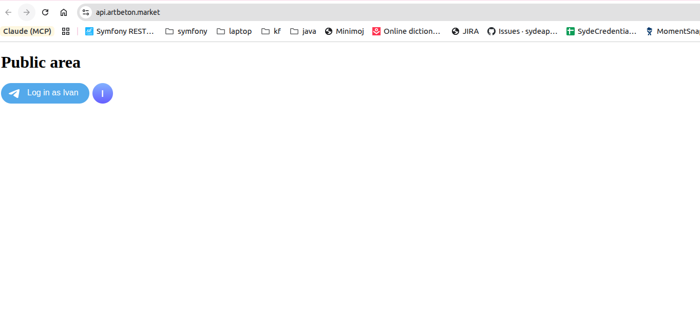
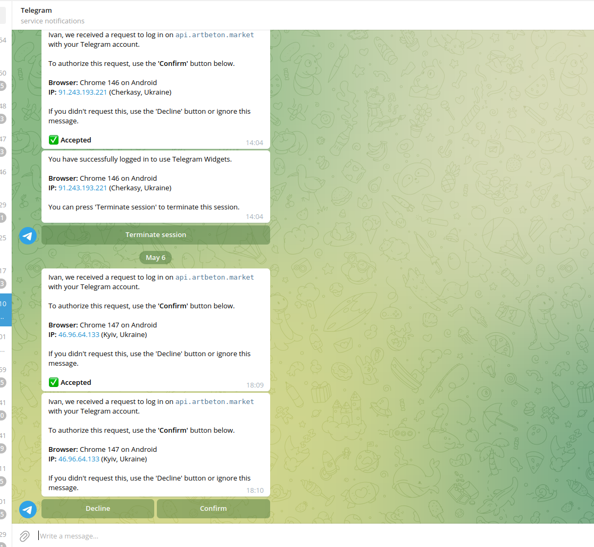
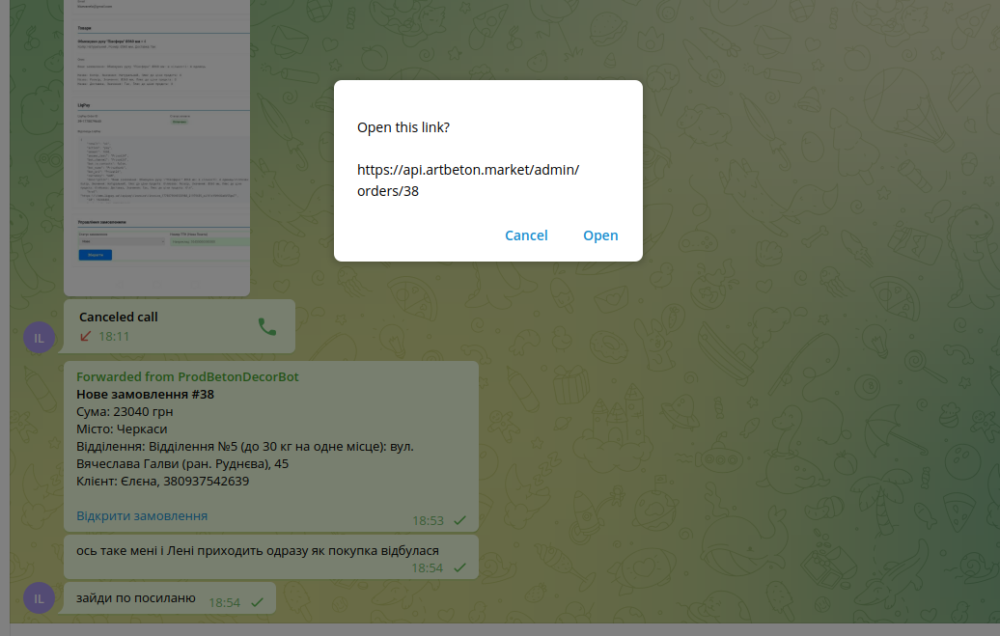
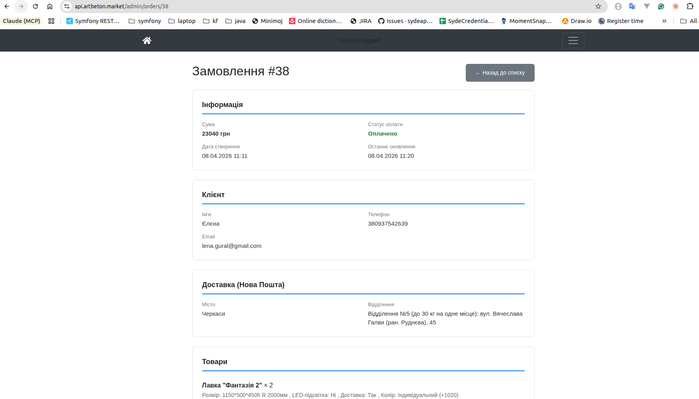
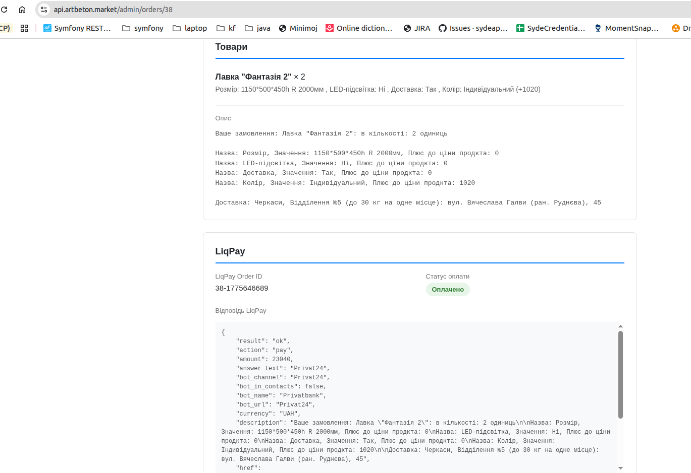
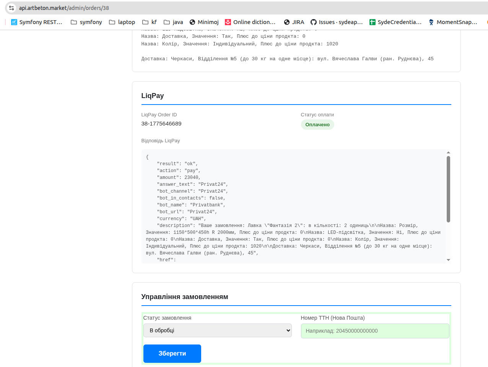

# Інструкція для оператора (Олег)

Щоб ви, як і Іван та Олена, почали отримувати в Telegram сповіщення про **нові оплачені замовлення** та мали доступ до адмін-панелі — виконайте кроки нижче по черзі.

---

## Крок 1. Зареєструватись у Telegram-боті

1. Відкрийте Telegram і знайдіть бота: **[@prod_beton_decor_bot](https://t.me/tbuddet_bot)**
2. Натисніть кнопку **Start** (або надішліть команду `/start`).
3. Коли бот попросить — **поділіться номером телефону** (натисніть кнопку «Поділитися контактом»).

> Це створить ваш обліковий запис у системі (рядок `TelegramUser`) із прив'язкою вашого `chat_id` — саме на нього бот зможе надсилати сповіщення про замовлення.

---

## Крок 2. Увійти в адмін-панель через Telegram

### 2.1. Відкрити публічну сторінку

Відкрийте у браузері: **[https://api.artbeton.market](https://api.artbeton.market)**

Ви побачите сторінку **Public area** з кнопкою **«Log in»** (Telegram-віджет):



### 2.2. Підтвердити вхід у Telegram

Після натискання кнопки прийде повідомлення в Telegram від **Telegram service notifications** з проханням підтвердити вхід. Натисніть **Confirm**:



> У повідомленні буде вказано ваш браузер та IP — переконайтесь, що це справді ви.

### 2.3. Перейти в адмін-панель

Після підтвердження відкрийте: **[https://api.artbeton.market/admin](https://api.artbeton.market/admin)**

> Якщо побачите помилку **403 Forbidden** — це нормально на цьому етапі: означає, що обліковий запис створено, але роль ще не призначено. Переходьте до Кроку 3.

---

## Крок 3. Повідомити розробника

Надішліть Івану в Telegram **номер телефону**, який ви прив'язали до бота (у форматі `380XXXXXXXXX`).

Іван виконає на проді команду:

```bash
php bin/console app:assign-role --phone=380XXXXXXXXX --role=ROLE_MANAGER
```

Роль `ROLE_MANAGER` дає:
- доступ до адмін-панелі (`/admin`);
- автоматичні сповіщення в Telegram про **кожне нове оплачене замовлення** (як зараз отримують Іван і Олена).

---

## Крок 4. Як виглядає сповіщення про нове замовлення

Після призначення ролі ви почнете отримувати в Telegram повідомлення такого вигляду:



У сповіщенні є:
- номер замовлення (`#38`);
- сума, місто, відділення Нової Пошти;
- ім'я та телефон клієнта;
- посилання **«Відкрити замовлення»** — натисніть, щоб одразу перейти в адмінку.

---

## Крок 5. Робота з замовленням в адмін-панелі

Після переходу за посиланням ви потрапите на сторінку замовлення.

### 5.1. Загальна інформація і клієнт



Тут ви бачите:
- **Інформацію** — суму, статус оплати, дати;
- **Клієнта** — ім'я, телефон, email;
- **Доставку** — місто та відділення Нової Пошти.

### 5.2. Товари і LiqPay



- Список **товарів** із характеристиками (розмір, колір тощо);
- Блок **LiqPay** з ID платежу та повною відповіддю від платіжної системи.

### 5.3. Управління замовленням



Тут ви як оператор можете:
- змінити **Статус замовлення** (наприклад, з «В обробці» на «Відправлено»);
- ввести **Номер ТТН (Нова Пошта)** після відправки;
- натиснути **Зберегти**.

> Після збереження ТТН клієнт автоматично отримує сповіщення про відправку.

---

## Що робити, якщо щось не працює

| Проблема | Рішення |
|----------|---------|
| Бот не пропонує поділитися контактом | Надішліть `/start` ще раз; якщо не допомогло — напишіть Івану |
| 403 на `/admin` після призначення ролі | Вийти з акаунта та увійти знову через Telegram-віджет |
| Не приходять сповіщення про замовлення | Перевірити, чи бот не заблокований у Telegram; повідомити Івану |
| Не приходить підтвердження входу в Telegram | Перевірити, що в Telegram дозволено повідомлення від `Telegram` service |

---

## Контакти

- **Розробник (Іван)** — для надання прав і технічних питань
- **Telegram-бот** — [@prod_beton_decor_bot](https://t.me/tbuddet_bot)
- **Адмін-панель** — [https://api.artbeton.market/admin](https://api.artbeton.market/admin)
